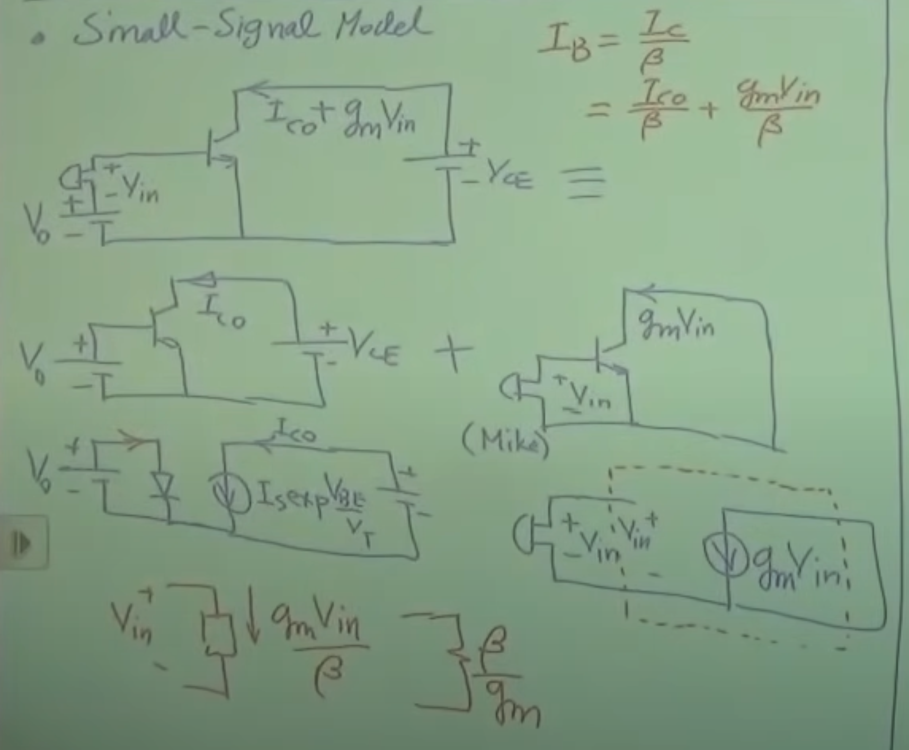
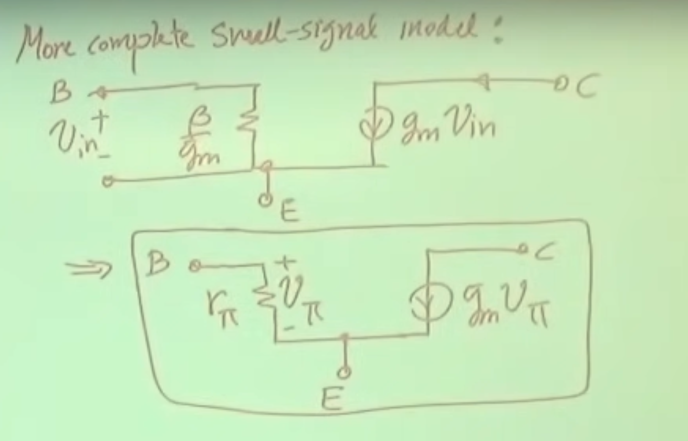

# Razavi Electronics 1, Lec 17, Bipolar Small-Signal Model, Early Effect

This is my note for the electronics from razavi, I hope I can keep going it!!!

---

## Table of Contents

1. [Small-Signal Model of Bipolar Transistor](#small-signal-model-of-bipolar-transistor)
2. [Early Effect](#early-effect)

---
## Small-Signal Model of Bipolar Transistor
+ 
+ 
+ To find the small-signal parameters, we must first calculate the bias conditions.
### Question: What happens to batteries with constant voltage source in small-signal operation (analysis)?
+ zero voltage source is equivalent to short circuit
+ zero current source is equivalent to open circuit
+ Notation: 
    + large-signal quantities: uppercase such as $V_{in}$, $I_C$, $V_{BE}$.
    + small-signal quantities: lowercase such as $v_{in}$, $i_C$, $v_{BE}$. 

---
## Early Effect
+ 
