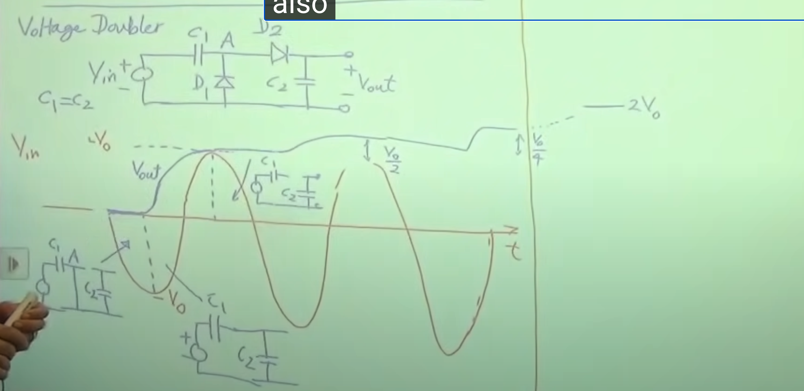

# Razavi Electronics 1, Lec 12, Limiters and Voltage Doublers

This is my note for the electronics from razavi, I hope I can keep going it!!!

---

## Table of Contents

1. [Limiting Circuits](#limiting-circuits)
2. [Voltage Doubler](#voltage-doubler)
3. [Level Shift](#level-shift)

---
## Limiting Circuits
+ Two diodes as the output components($V_{out} \approx 700mV$), one clips postive input voltage, other clips negative input voltage
---
## Voltage Doubler
+ RFID(Radio-Fequency Identification) System 
+ The sinusiod waveforms from scanner  are received by antenna (Passport) and goes through **Voltage Multiplier** becomes DC charge capacitor
+ The capacitor charge up the RFID-chip
+ To charge a capacitor, you need to place positive charge on one plate and negative charge on the other
+ In capacitive divider, $\frac{V_{out}}{V_{in}} = \frac{1/(C_2S)}{1/(C_1S) + 1/(C_2S)} = \frac{C_1}{C_1+C_2}$, to compare, resistive divider,  $\frac{V_{out}}{V_{in}} = \frac{R_2}{R_1+R_2} $

+ 

---
## Level Shift
+ Using diode guarantee always on to make a shift between $V_{out}$ and $V_{in}$, a current source generate current from anode to cathode 
