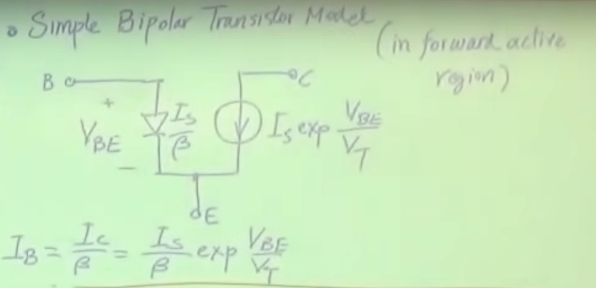
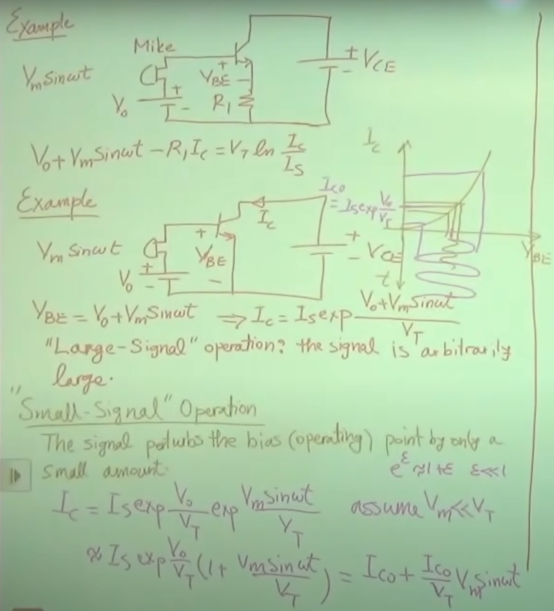

# Razavi Electronics 1, Lec 16, Large-Signal & Small-Signal Operation

This is my note for the electronics from razavi, I hope I can keep going it!!!

---

## Table of Contents

1. [I-V Characteristics of Bipolar Transistor]()
2. [Simple Transistor Model]()
3. [Large-Signal and Small-Signal Operation]()

---
## I-V Characteristics of Bipolar Transistor
+ see youtube video
### Combining Time Response with I-V Characteristics
+ The $V_{BE}$ changes with time, so does $I_C$

---
## Simple Transistor Model
+ 

---
## Large-Signal and Small-Signal Operation
+ Large-Signal operation: the signal is arbitrarily large
+ Small-Signal operation: the signal perturbs the bias(operating point) by only a small amount.
+ 